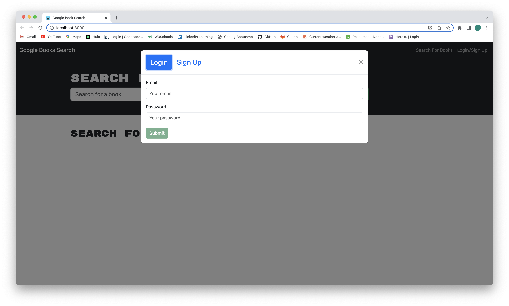

# my-library

## Description

My Library is an application that allows a user to search for books on the google books api, and when logged in, save a list of books for their future reading enjoyment.  Once they have read a book, they have the option to delete that book fromo their list.

The application was originally written with a RESTful API in the back end. The application's owner requested a change on the back end to use MongoDB, with GraphQL, and an Apollo Server.

This project gave me some insight into the process of refactoring an existing product into a different format, and all the details that could potentially be affected.  I found it was difficult at times to understand exactly which parts of the application I needed to keep in order to maintain the functionality, and which ones needed to be changed.  I feel this will improve with time and experience, but did find it to be a frustrating part of this particular assignment.

Another area of challenge for me continues to be the authorization piece.  Using MongoDB Compass, I could tell that my signup form was getting user information into the database, but it was difficult for me to get the login page to authenticate the user and identify logged in status.  I would like to continue to work on this part of the application, so that I have better understanding of exactly what the code is doing.

## Table of Contents

-[Installation](#Installation)

-[Usage](#Usage)

-[Credits](#Credits)

-[License](#License)

-[Questions](#Questions)

## Installation

To start the application, please navigate to:

[my-library deployment]()

## Usage

From the application's home page, the user can simply start a search for books.

The user is able to search for books using a title,

or by using an author's name.

If the user wishes to save a list of books, they can use the login/signup link in the upper right hand corner to access the signup window, then complete the form.

If the user already has an account inside the application, they can use the login link (again, in the upper right hand corner of the home page) to open their account and view their list of saved books.

 
## Credits

I referred to the class exercises, some google searches, and a couple posts on Stack Overflow for help with this challenge.  The starter code is ©2023 EdX bootcamps.

## License

 
[MIT License](https://opensource.org/license/mit-0/)
 
For the complete text of the license, please click on the link provided.

## Questions

If you have questions, please reach out to me at:

[github profile](github.com/lhardywilcox)

or

[email](motacycaryda@mac.com)